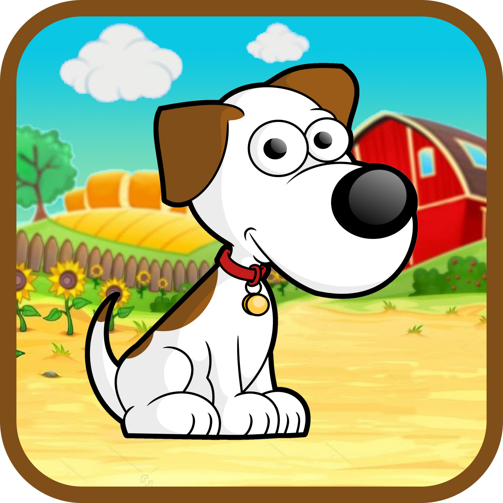
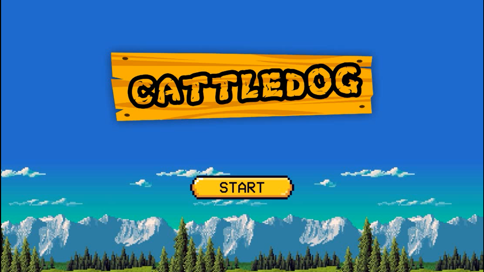
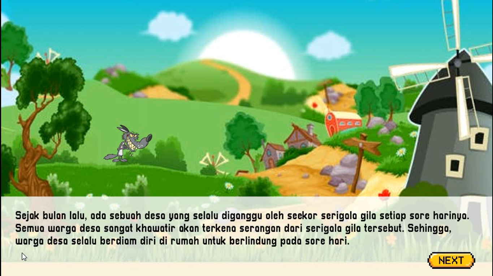
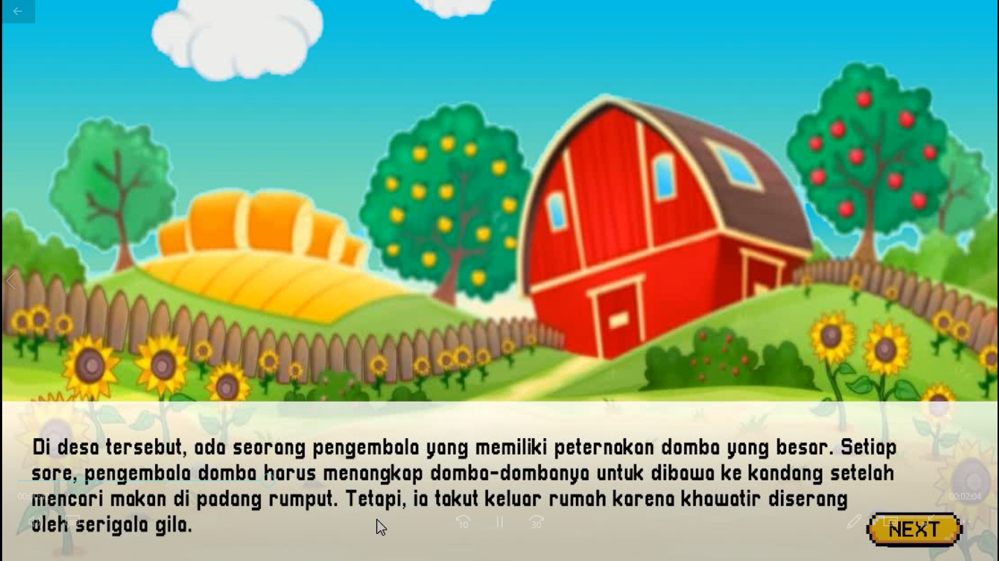
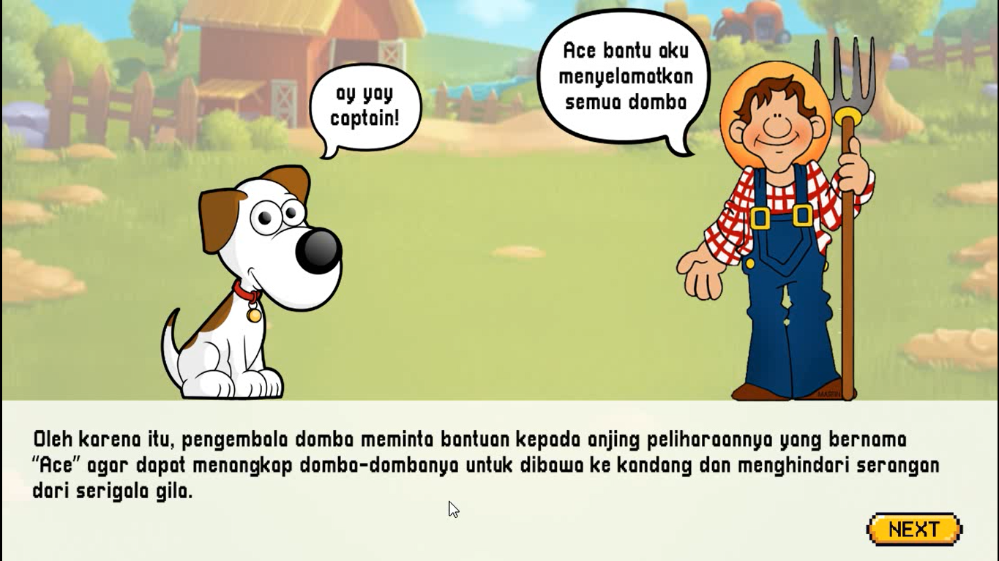
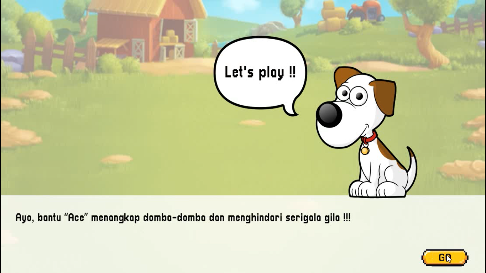
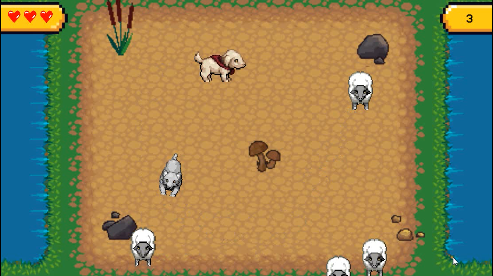
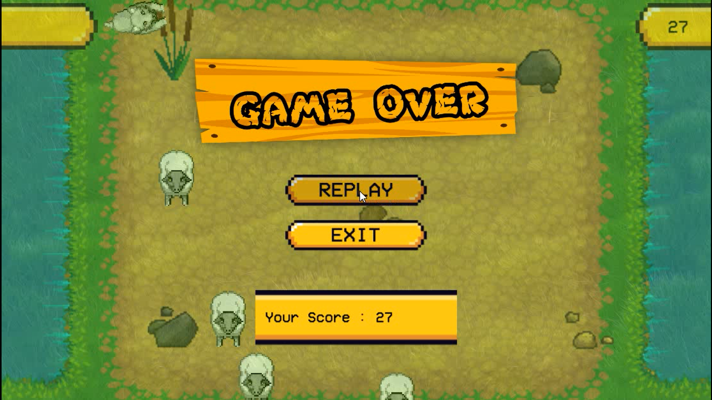

# Cattledog

**Paralel : P1 (Rabu)**  

**Kelompok : 11**   
  
**Pembagian Role :**
| Nama | NIM | Role |
| ---- | --- | ---- |
| Ulfainil Aisyah | G64180045 | Game Designer |
|	Irsyad Musyaffa | G64180048 | Game Programmer |
|	Putri Melanita Londong Bua | G64180053 | Game Artist |  

---  

<b>Link Game Cattledog</b>

<a href="https://ipb.link/cattledog-game">cattledog.rar</a>

## Story Game
&nbsp;&nbsp;&nbsp;&nbsp;
Sejak bulan lalu, ada sebuah desa yang selalu diganggu oleh seekor serigala gila setiap sore harinya. Semua warga desa sangat khawatir akan terkena serangan dari serigala gila tersebut. Sehingga, warga desa selalu berdiam diri di rumah untuk berlindung pada sore hari.  
&nbsp;&nbsp;&nbsp;&nbsp;
Di desa tersebut, ada seorang pengembala yang memiliki peternakan domba yang besar. Setiap sore, pengembala domba harus menangkap domba-dombanya untuk dibawa ke kandang setelah mencari makan di padang rumput. Tetapi, ia takut keluar rumah karena khawatir diserang oleh serigala gila.  
&nbsp;&nbsp;&nbsp;&nbsp;
Oleh karena itu, pengembala domba meminta bantuan kepada anjing peliharaannya yang bernama “Ace” agar dapat menangkap domba-dombanya untuk dibawa ke kandang dan menghindari serangan dari serigala gila.

## Rules
* Ace bertugas untuk menangkap semua domba yang muncul untuk diselamatkan sebelum diserang oleh serigala gila.
* Ace akan mati jika diserang oleh serigala gila.
* Serigala gila akan menyerang Ace dan domba-domba yang muncul.
* Domba akan menghilang jika telah ditangkap oleh Ace dan skor akan akan bertambah.
* Sekali permainan akan disediakan 3 nyawa untuk Ace, jika 3 nyawa Ace habis maka permainan selesai dan pemain kalah.

## Goals
**Menang** : Ace menangkap semua domba sebanyak-banyaknya hingga mencapai skor tertinggi.  
**Kalah**	: Tiga nyawa yang dimiliki Ace telah habis.

## Assets List
* **Main Menu**
  + Background
  + Judul : Cattledog
  + Button : Start
* **Story Game**
  + Background : Desa, Peternakan, Halaman
  + Tokoh story : Serigala gila, Pengembala domba, Ace
  + Bubble talk
  + Button : Next, Go
* **Game Play**
  + Karakter : Ace, Serigala gila, Domba
  + Obstacle : Batu, Jamur, Tanaman
  + Terrain : Tanah, Rumput, Kolam
  + Heart
  + Score 
* **Game Over Panel**
  + Background transparent
  + Judul : Game Over
  + Button : Replay, Exit
  + Your score
* **Font**
  + Pixellari
  + VCR OSD Mono
* **Music**
  + Home theme
  + Story theme
  + Game theme
  + Button click
  + Score added
  + Lose life
  + Game over
* **Assets Source**  

| Assets | Source |
| ------ | ------ |
| General | [assetstore.unity.com](https://assetstore.unity.com/) |
|	Animal Character | [rpgtileset.com/sprite](https://rpgtileset.com/sprite) |
|	Farmer | [webstockreview.net/images250_/farmers-clipart.png](https://webstockreview.net/images250_/farmers-clipart.png) |
| Dog Character (Story) | [www.pngkey.com/png/full/1-18550_free-cartoon-dog-vector-clip-art-dog-clipart.png](https://www.pngkey.com/png/full/1-18550_free-cartoon-dog-vector-clip-art-dog-clipart.png) |
|	Story Background | <li>[storyweaver.org.in/illustrations/41705-green-village](https://storyweaver.org.in/illustrations/41705-green-village)</li><li>[clipartspub.com/images/clipart-farming-background-farmyard-5.jpg](https://clipartspub.com/images/clipart-farming-background-farmyard-5.jpg)</li> |
|	Landing Page Background | [wallhere.com/en/tag/2378](https://wallhere.com/en/tag/2378) |
| Terrain | [opengameart.org/sites/default/files/terrain_2.png](https://opengameart.org/sites/default/files/terrain_2.png) |
|	Start Board | [i.pinimg.com/originals/9b/0b/72/9b0b72e40b416275841ad74994964015.png](https://i.pinimg.com/originals/9b/0b/72/9b0b72e40b416275841ad74994964015.png) |
|	Music | <li>[soundcloud.com/sdsoundtracks/fun-games](https://soundcloud.com/sdsoundtracks/fun-games)</li><li>[www.zapsplat.com/](https://www.zapsplat.com/)</li> |

## Tools and Technology
| Tools and Technology | Keterangan |
| -------------------- | ---------- |
| Unity Hub 2.4.2 | Untuk mengatur instalasi Unity, manajemen project, dan kolaborasi |
| Unity version 2019.4.13f1 (LTS) | Untuk mengembangkan game dan mengolah asset |
| GitHub | Untuk menyimpan repository dan kolaborasi |
| Visual Studio Code | Sebagai code editor untuk script game |
| C# | Bahasa pemrograman untuk script game |
| Figma | Untuk membuat assets |
| Hukum Fisika | Rigid Body 2D, Object Collider |
| Transformasi | Translasi |
| Algoritme | Pathfinder A* |

## Screenshot
<ul><li><b>Main Menu</b></li></ul>

<ul><li><b>Story Game</li></b></ul>

<ul><li><b>Game Play</li></b></ul>

<ul><li><b>Game Over Panel</b></li></ul>

